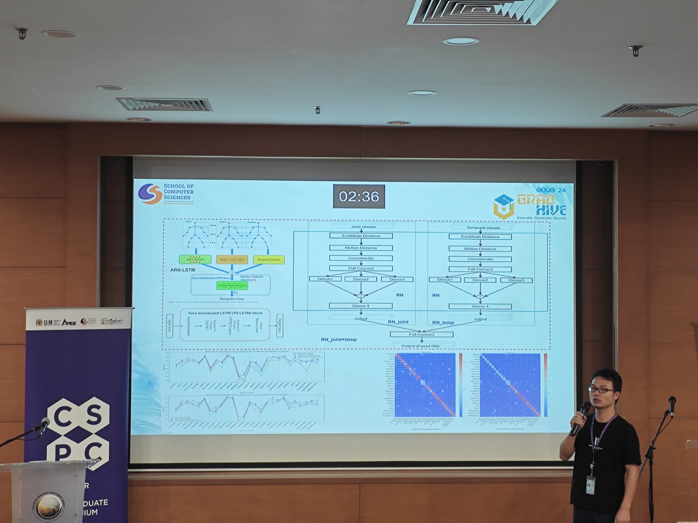

# ARN-LSTM:A Multi-Stream Attention-Based Model for Action Recognition with Temporal Dynamics

> It contains an implementation of our Attention Relation Long Shor-term Memory Network (ARN-LSTM ), an
> end-to-end NN model for Group Activity Recognition using Skeleton information. 


<div align="center">
    
</div>

CSPC 2024 Website: Visit the CSPC website for details https://cspc.cs.usm.my/home

## The code details will be soon when it is sorted well.

# Requirements
      


# Dataset
The datasets we used are as follows:
- [NTU RGB+D 60](https://arxiv.org/pdf/1604.02808.pdf)
- [NTU RGB+D 120](https://arxiv.org/pdf/1905.04757.pdf)

The raw dataset was downloaded from the dataset home page https://rose1.ntu.edu.sg/dataset/actionRecognition/.

There are 302 samples of **NTU RGB+D 60** and 532 samples of **NTU RGB+D 120** need to be ignored.Ref [link](https://github.com/shahroudy/NTURGB-D/blob/master/Matlab/NTU_RGBD_samples_with_missing_skeletons.txt).

Due to database requirements in this paper, we provide restricted access to the reprocessed dataset[NTU RGB+D 60&120](https://doi.org/10.6084/m9.figshare.27427188.v1)


# Running
## Modify configs
First you shoud modify the dataset directory path in NTU.py and NTU_V2.py files of the 'datasets' folder.
Then, you can modify the configuration of the parameters in the 'configs/NTU_V1' or 'configs/NTU_V2' for different dataset.

## Training

```bash
nohup bash final_runs.sh > final_runs.log 2>&1& 
```
Models and results will be saved at folder: 'runs/DATASET/EXPERIMENT_NAME/'. 

## Results
The results of the trained model can be accessed directly from this URL[]()
